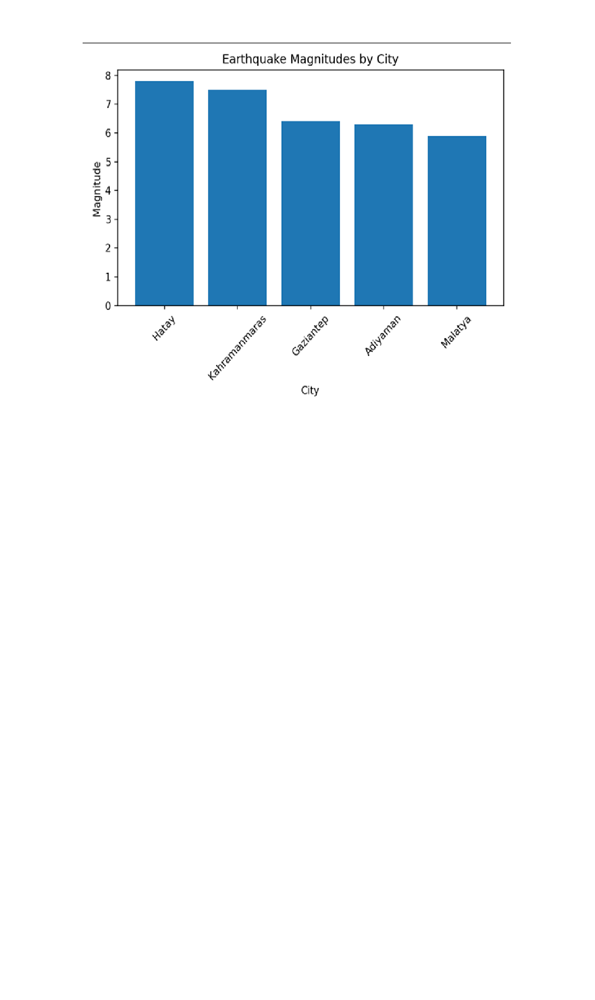

# earthquake-data-analysis
Analysis of earthquake data using Python
# Earthquake Data Analysis

This project analyzes earthquake data using Python.

## Goals

- Load earthquake datasets
- Clean and organize data
- Visualize earthquake locations
- Analyze magnitude distributions

## Tools

- Python
- Pandas
- Matplotlib

## Author

Kagan Orun

## Sample Output

The chart below shows earthquake magnitudes for selected cities affected by major earthquakes in Türkiye.

